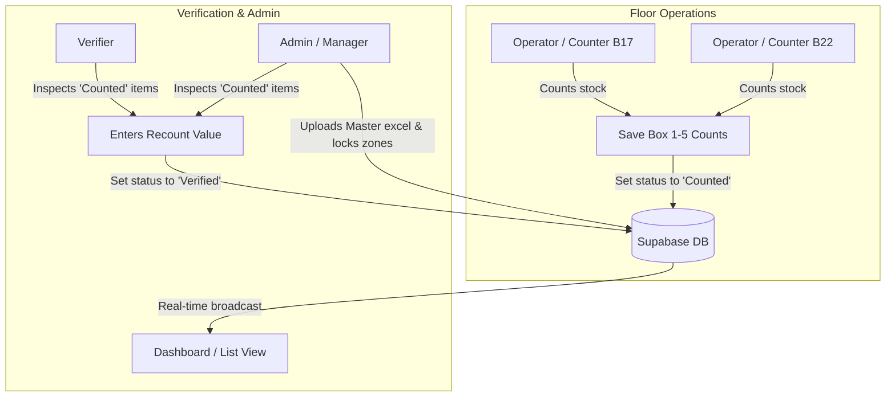

# Implementation Plan: VGM Stock Take & Battery Tracking Upgrade

This document describes the current system architecture and outlines the roadmap for upgrading the application. This update addresses:
1.  **Concurrency (40+ concurrent users):** How the system will scale to handle multiple users writing data at the same time.
2.  **Implementation Details:** A technical breakdown of the Verification & Auditing Dashboard.

---

## 1. Running the Current Application

To preview the current web application locally:
1.  Open your terminal.
2.  Run these commands:
    ```bash
    cd "c:\Adib\Portfolio\VGW\vgm-stock-take"
    npm run dev
    ```
3.  Open the web address displayed in the terminal (typically `http://localhost:5173`) in your browser.

---

## 2. Current Workflow Architecture

This diagram shows how data flows today, highlighting that **Operators (Counters)** input initial numbers, while **Admins** and **Verifiers** check and confirm them.



---

## 3. Concurrency Strategy: Handling 40+ Simutaneous Users

When 40 operators are entering counts at the same time, database performance and UI updates must remain stable. PostgreSQL (Supabase) handles this easily, but the app uses several patterns to guarantee stability:

```
[40 Operators Saving Counts]
            │
            ├──► [Client-Side Optimistic UI] (App updates instantly without waiting for DB response)
            │
            ├──► [PostgreSQL Connection Pooler (PgBouncer)] (Queues database connections efficiently)
            │
            └──► [Supabase Realtime Broadcast Rate Limiter] (Batches UI updates to prevent flickering)
```

*   **Database Scaling:** Supabase uses PostgreSQL, which natively supports hundreds of concurrent write connections. Connections are managed automatically via a connection pooler (PgBouncer) so the database never gets overwhelmed.
*   **Optimistic UI Updates:** When an operator saves a count, the local screen updates *instantly* rather than waiting for the database to reply, keeping the app fast and lag-free.
*   **Realtime Batching:** The Supabase Realtime client is configured to throttle UI refreshes. Instead of rendering the screen 40 times per second as updates fly in, updates are batched together and rendered once every few hundred milliseconds.

---

## 4. Improvement Options

Here is the breakdown of the three improvement modules:

### Module 1: Battery Tracking Camera Scanner
Currently, the `/battery` route is a placeholder. This module builds the full **Battery Tracking** feature for operators.

*   **Objective:** Let `Operator Batt` scan battery QR codes or barcodes using their mobile/tablet camera to track battery statuses and lifecycles.
*   **Workflow:**
    1.  Operator navigates to `/battery` and taps **"Scan Battery"**.
    2.  The camera feed opens with a scanning viewfinder.
    3.  Once a barcode is read, the app decodes the battery ID, checks its status in Supabase, and allows updating its location or charging status.
*   **Library:** Integrates `html5-qrcode` to handle multi-format barcode parsing in the browser.

---

### Module 2: Offline-First Synchronization
Warehouse floors frequently lose internet connectivity. This module makes the counting process robust against connection drops.

*   **Objective:** Prevent counters from losing their count inputs if Wi-Fi drops mid-session.
*   **Workflow:**
    1.  When an Operator inputs box counts and taps **"Save"**, the app checks network status.
    2.  If online, it saves directly to Supabase.
    3.  If offline, it saves to browser local storage (`IndexedDB`) and queues it.
    4.  An automatic background listener detects when Wi-Fi is restored and pushes all queued changes to Supabase in order.

---

### Module 3: Verification & Auditing Dashboard (Implementation Plan)
This feature helps Admins and Verifiers quickly locate counting errors. Here is how we will build it:

```
[Supabase Table Row] ──► [Read Counted Qty vs Book Qty] ──► [Compute Variance %] ──► [Color-code & Filter in UI]
```

#### Step 1: Database Schema Expansion
We will utilize the `metadata` column (JSONB) or add dedicated database fields:
*   `book_qty` (integer): The expected system inventory quantity uploaded from the master spreadsheet.
*   `verified_by` (text): The name or ID of the Admin/Verifier who approved the count.
*   `verified_at` (timestamp): The exact date and time the count was approved.

#### Step 2: Math Logic for Variance & Deviation
When an operator saves a count, the system calculates the variance:
$$\text{Variance} = \text{Counted Qty} - \text{Book Qty}$$
$$\text{Variance \%} = \left( \frac{|\text{Variance}|}{\text{Book Qty}} \right) \times 100$$
If the **Variance %** is greater than $10\%$, the row is automatically flagged in the Admin UI with a red visual warning badge.

#### Step 3: UI Design for Admins & Verifiers
We will build a **Verification Console** page in `/reports` containing:
1.  **Discrepancy Toggle:** A switch showing *only* items with status `Counted` that have a variance greater than 10%.
2.  **Audit Trail logs:** A timeline at the bottom showing recent actions (e.g., *"John (Verifier) approved Material 9042 at 2:15 PM"*).
3.  **One-click Export:** A button to export only the mismatched entries to an Excel sheet for physical recount coordination.
